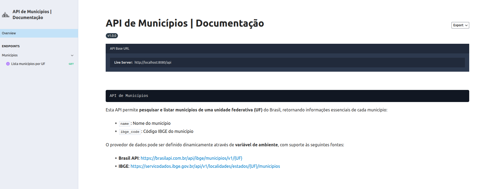

# API de Municípios Laravel

Projeto Laravel containerizado para testes e desenvolvimento local.

> A documentação completa da API estará disponível em: [http://localhost:8080/docs/api](http://localhost:8080/docs/api)



## 🛠 Pré-requisitos

- Docker >= 24  
- Docker Compose >= 2  


## ⚡ Rodando a aplicação localmente
Siga os passos abaixo para iniciar o projeto:

1. Clone o repositório:

```bash
git clone https://github.com/TarcisioAraujo7/idez-desafio
cd idez-desafio
```

2. Copie o arquivo de ambiente:
```bash
cp .env.example .env
```

3. Build e suba os containers:
```bash
docker compose up -d --build
```

4. Gere a chave da aplicação:
```bash
docker compose exec app php artisan key:generate
```

5. Rode as migrations:
```bash
docker compose exec app php artisan migrate
```

6. Acesse a aplicação:
- API: http://localhost:8000
-   Documentação: http://localhost:8080/docs/api

## 📦 Comandos úteis

### Testes e Qualidade de Código

- **Rodar testes com PHPUnit**

```bash
docker compose exec app php artisan test
```

- **Rodar PHPStan (análise estática de código)**

```bash
docker compose exec app ./vendor/bin/phpstan analyse --memory-limit=512M
```

- **Rodar Laravel Pint (formatação de código)**

```bash
docker compose exec app ./vendor/bin/pint
```
